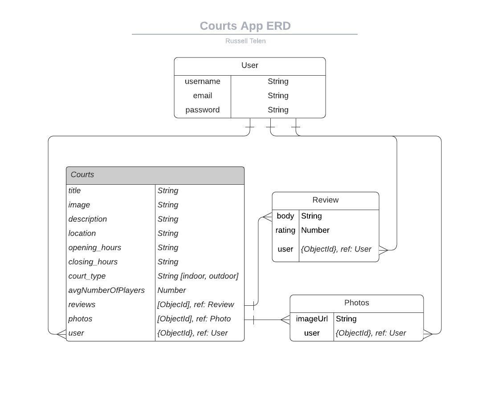

# COURTS - Full Stack Web App by Russ Telen

## About

    Courts is an app that allows basketball players to view bsaketball courts nearby. Users are also able to upload photos of the court they were playing at. In addition, players can leave ratings and reviews to reflect their experience on a specific court

## View the App

# [Courts](https://russtelen-courtsapp.herokuapp.com/)

## Tech Stack

- NodeJS
- Express
- MongoDB
- EJS
- Bootstrap
- CSS
- Heroku

## Features / Learning Outcomes

- RESTFUL API
- Implement CRUD of models
- Demonstrate data relationships (eg one to many)
- Error Handling
- Client/Server Side Validations
- Session and Flash
- Authentication and Authorization using passport.js
- Custom middlewares
- Geocoding locations to add maps using Mapbox

## Preview

## ERD

## Additional Info

Color Scheme
556052
af6b58
cbbcb1
f2efea

https://colorhunt.co/palette/220190
